# ACME AIR

Maquetación de la aplicación web móvil de **ACME AIR**, una aerolínea internacional que renueva su experiencia digital. El proyecto se construye únicamente con **HTML5 y CSS3**, sin JavaScript, a partir de las maquetas del departamento de diseño UI/UX.

## Objetivo

Ofrecer una interfaz limpia, intuitiva y responsiva, con identidad visual coherente y navegación simulada entre las 9 vistas, desde el inicio de sesión hasta la consulta de vuelos.

## Tecnologías

- HTML5 semántico
- CSS3 (variables, Flexbox, CSS Grid y media queries)
- Diseño mobile-first con puntos de quiebre en 320px, 768px y 1024px

## Integrantes

- Rodrigo Trujillo
- Sebastián Panche
- Dainer Cuteño

## Guía de navegación

| Vista | Archivo | Va hacia |
| --- | --- | --- |
| Iniciar sesión | `index.html` | Ingresar → Menú · Crear cuenta → Registro · ¿Olvidaste tu contraseña? → Recuperar contraseña |
| Menú principal | `menu.html` | Buscar vuelos · Check In · Mis vuelos · Cerrar sesión → Iniciar sesión |
| Registro | `registro.html` | Guardar → Crear contraseña |
| Recuperar contraseña | `recuperar.html` | Enviar → Crear contraseña |
| Crear contraseña | `crear-contraseña.html` | Guardar → Menú |
| Búsqueda de vuelos | `buscar-vuelos.html` | Buscar → Vuelos disponibles · Volver al menú principal → Menú |
| Vuelos disponibles | `vuelos.html` | Volver → Menú |
| Check In | `checkin.html` | Guardar → Menú |
| Mis vuelos | `mis-vuelos.html` | Volver → Menú |


## Capturas de las vistas: mockup vs resultado

Cada vista se compara cara a cara con el mockup del enunciado para revisar márgenes, colores, bordes, redondeos e iconografía. La iconografía es propia, porque el mockup es una guía y no incluye las imágenes originales.

### Móvil (320 px – 767 px)

| Vista | Mockup | Resultado (HTML + CSS) |
| --- | --- | --- |
| Iniciar sesión | 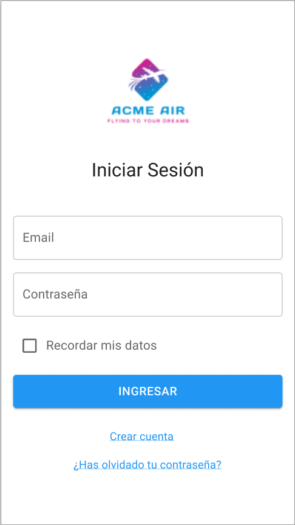 | 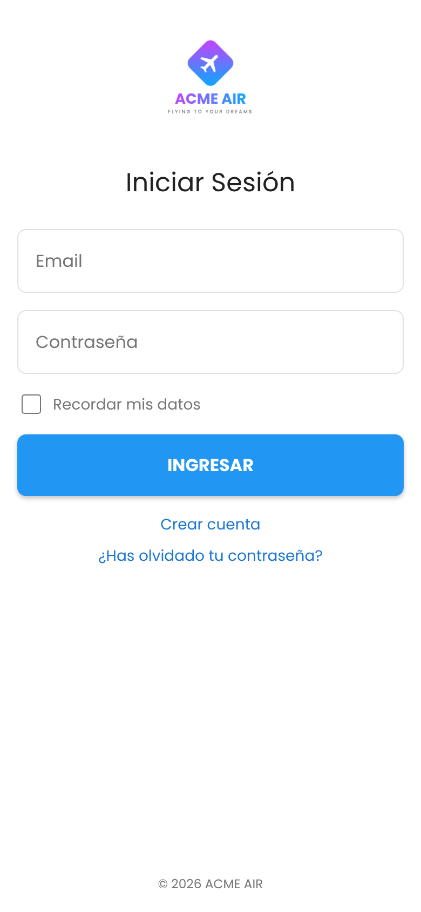 |
| Menú principal | 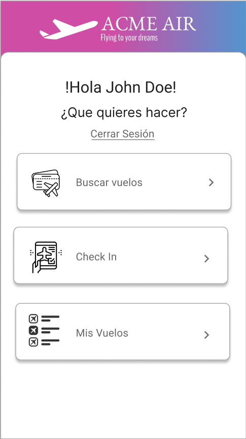 | 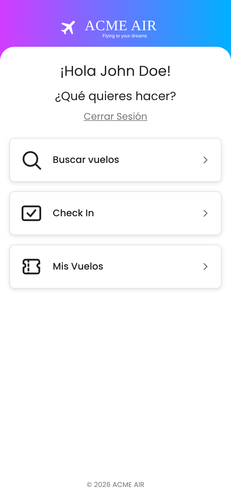 |
| Registro | 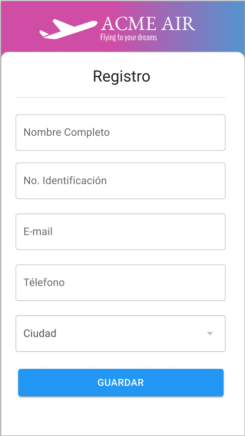 | 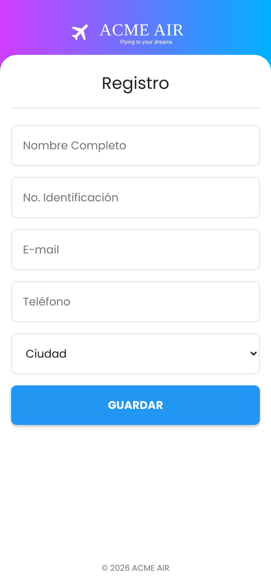 |
| Recuperar contraseña | 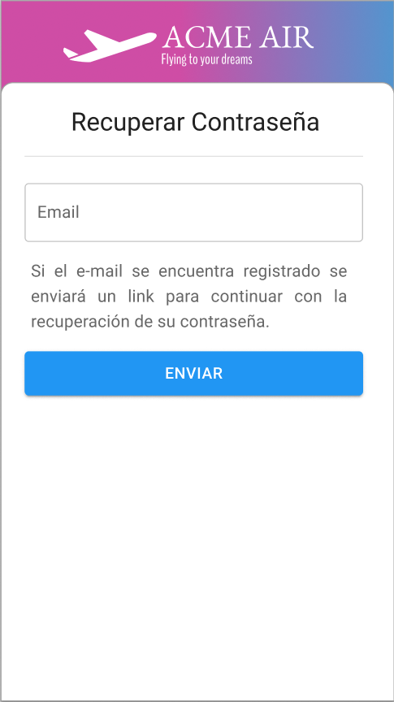 | 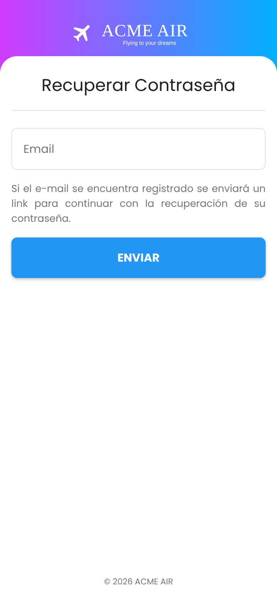 |
| Crear contraseña | 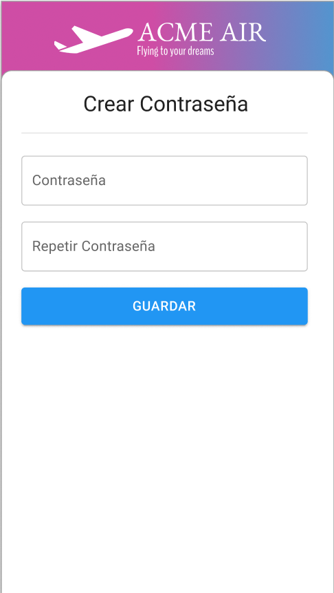 | 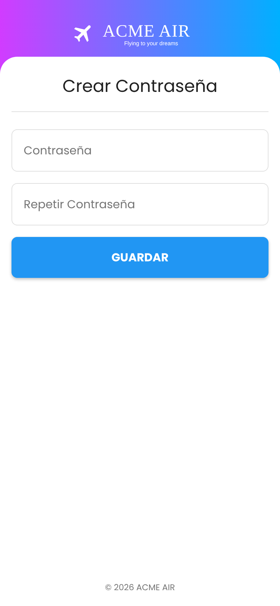 |
| Búsqueda de vuelos | 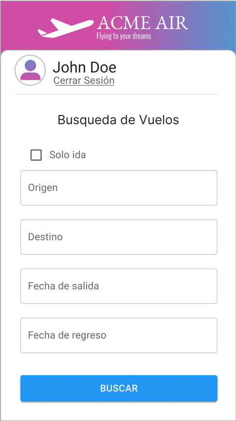 | 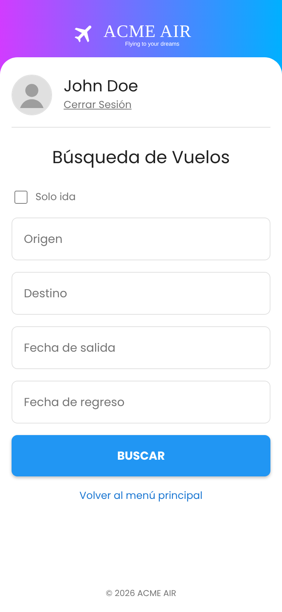 |
| Vuelos disponibles | 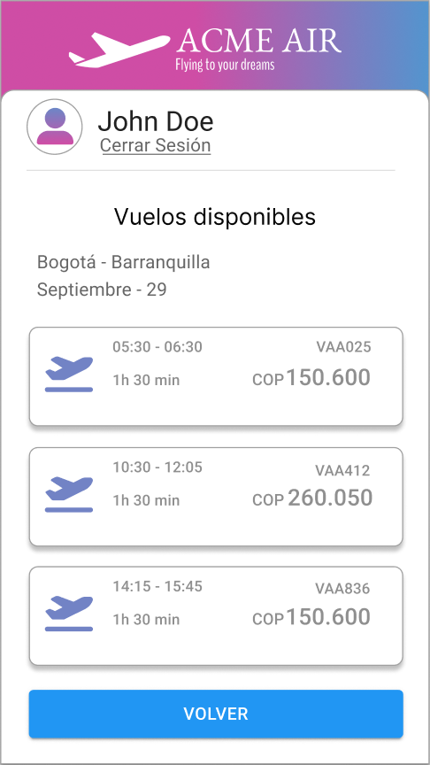 | 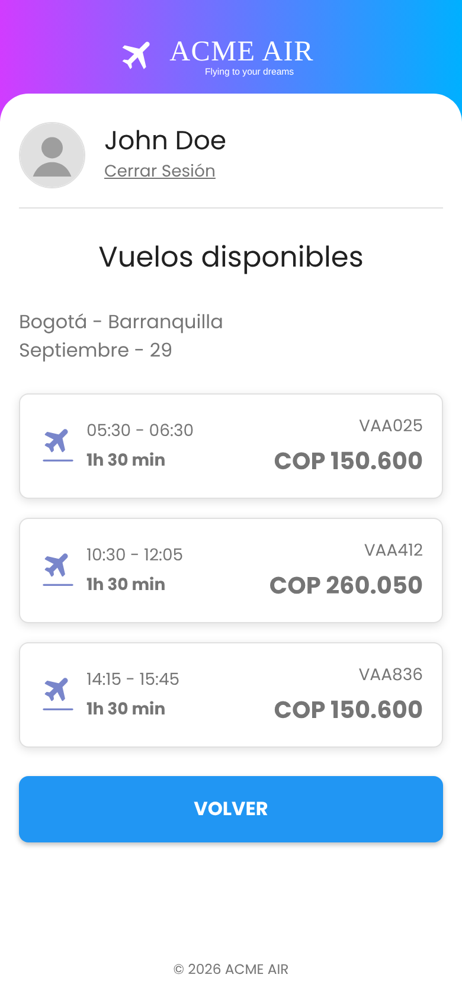 |
| Check In | 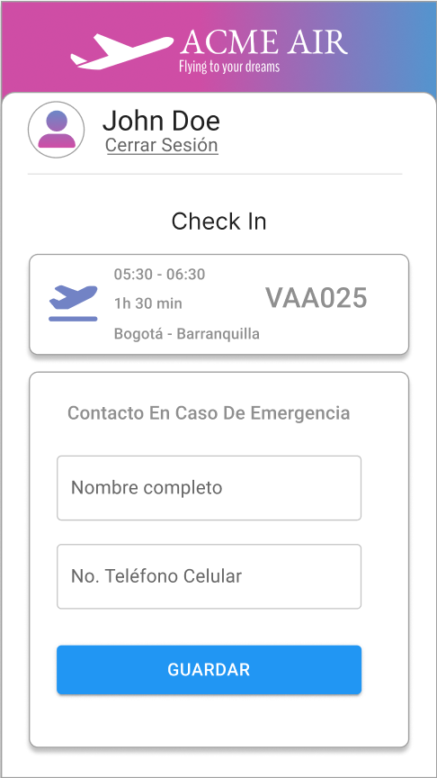 | 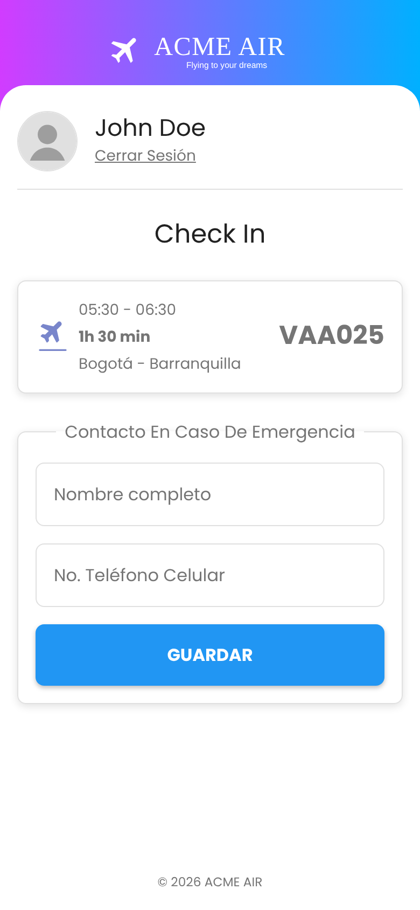 |
| Mis vuelos | 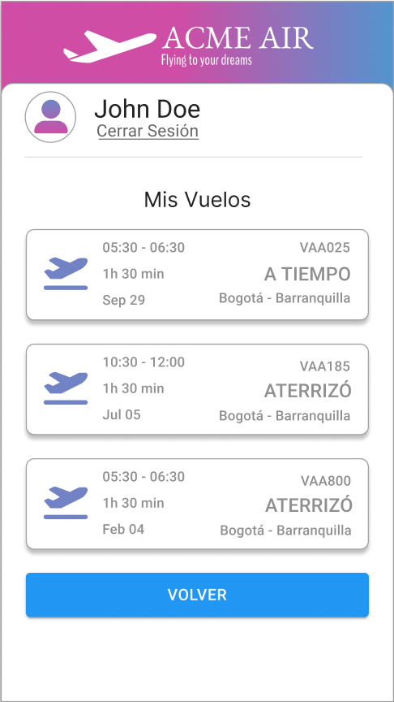 | 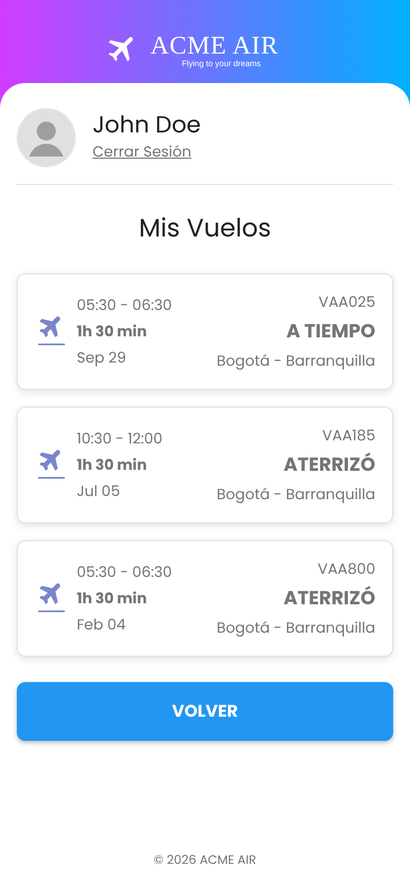 |

### Tableta y escritorio (desde 768 px)

Según el enunciado, el menú principal usa en tableta y escritorio una barra lateral y una cuadrícula de tarjetas.

| Mockup | Resultado en tableta (768 px) | Resultado en escritorio (1280 px) |
| --- | --- | --- |
| 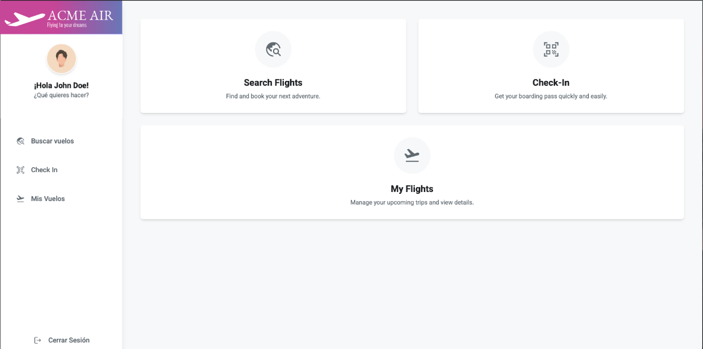 | 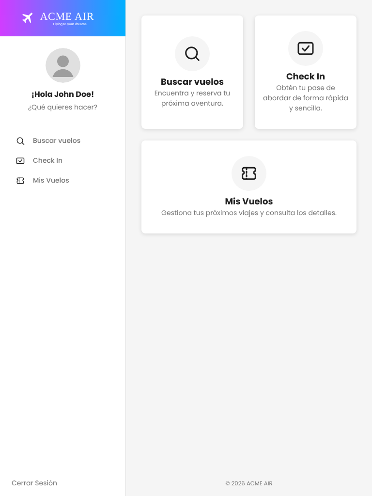 | 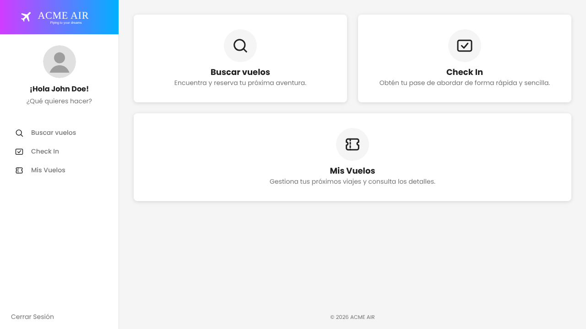 |

> **Nota:** la navegación es simulada, sin JavaScript (el enunciado no lo permite). Los datos que se muestran son fijos, como en el mockup; para una demostración coherente, inicia sesión con `johndoe@gmail.com`.

## Estructura del proyecto

```
acme-air-html-css/
├── index.html
├── menu.html
├── registro.html
├── crear-contraseña.html
├── buscar-vuelos.html
├── vuelos.html
├── checkin.html
├── mis-vuelos.html
├── recuperar.html
├── css/
│   ├── style.css
│   ├── forms.css
│   ├── layout.css
│   └── responsive.css
├── docs/
│   ├── mockups/      (mockups del enunciado)
│   └── capturas/     (resultado en HTML + CSS)
└── imagen/
    ├── logo.png
    ├── iconos/
    └── fondos/
```